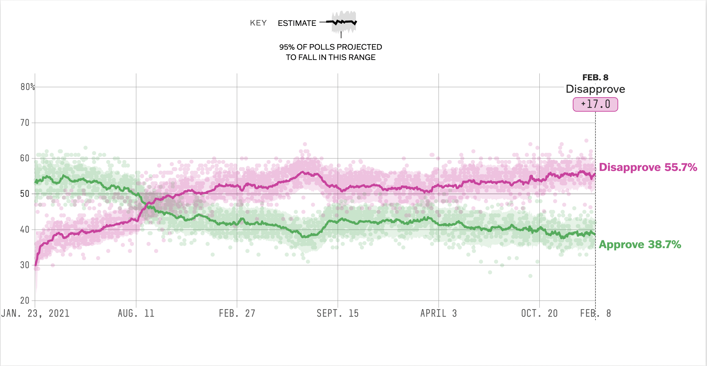

```{r setup, include=FALSE}
# Do not modify this chunk.
knitr::opts_chunk$set(echo = TRUE, warning = FALSE, message = FALSE)
```

```{r}
# Put all necessary libraries here
# I got you started!
# The first time you want to install the dsbox package; then you can comment it out.
# If you have not installed the devtools package, you will need to do so first
# install.packages("devtools")
# library(devtools)

devtools::install_github("tidyverse/dsbox")
library(dsbox)
library(tidyverse)
library(viridis)
```


## Due: Thursday, February 8th at 8:30am

## Goals of this lab

1. Practice coding to adhere to the Tidyverse Style Guide.
1. Practice creating and refining graphs with `ggplot2`.
1. Consider the strengths and weaknesses of various `geom`s and `aes`thetics for telling a data story.

## Notes:

* When creating your graphs, consider context (i.e. axis labels, title, ...)!
* If I provide partially completed code, I will put `eval = FALSE` in the chunk.  Make sure to change that to `eval = TRUE` once you have completed the code in the chunk.
* Be prepared to ask for help from me, Simon, and your classmates!  We scratched the surface of `ggplot2` in class.  But I encourage you to really dig in and make your graphs your own (i.e. don't rely on defaults).


## Problems


### Probem 1: Road traffic injuries in Edinburgh, Scotland 

The dataset can be found in the `dsbox` package, and is called `accidents`. It covers all recorded accidents in Edinburgh in 2018; compared to the dataset made available by the UK government, some of the variables were modified for the purposes of the package. You can find out more about the dataset by inspecting its documentation with `?accidents`. Recreate the following plot, and interpret the results.


```{r, out.width="100%", echo=FALSE}
knitr::include_graphics("../img/edi-accidents-1.png")
```

```{r}
accidents$weekend <- ifelse(accidents$day_of_week %in% c("Saturday", "Sunday"), "Weekend", "Weekday")
ggplot(data = accidents, aes(x = time, fill = severity)) + 
  scale_fill_manual(values = c("purple", "36, 202, 216", "yellow")) +
  geom_density(alpha = 0.3) + 
  facet_wrap(~ weekend, ncol = 1) + 
  labs(title = "Number of accidents throughout the day", 
       subtitle = "By day of week and severity",
       x = "Time of day",
       y = "Density",
       fill = "Severity") +
  theme_minimal()
```

In this dataset, there were no fatal accidents on weekends. Irrespective of whether or not it was a weekend, it seems that afternoons/evenings (between about 2:00pm and 8:00pm) have the highest proportion of serious and slight accidents. The highest proportion of fatal accidents occur during the late morning and early afternoon, peaking around noon. Early evenings and early mornings have the smallest proportion of fatal accidents, but have local peaks in the middle of the night. 

### Problem 2: One Dataset, Visualized ~~25~~ 5 Ways

Inspired by Nathan Yau's [One Dataset, Visualized 25 Ways](https://flowingdata.com/2017/01/24/one-dataset-visualized-25-ways/), I want you to create 5 visualizations of the same data. You can use the `mpg` dataset or another dataset of your choosing, including the `accidents` dataset above. Make sure you have the data manual open for this problem!  

a. Pick 3 - 4 variables you want to explore.  Provide their code names here.

```{r}
head(mpg)
```
trans - the transmission of the car, cty - the MPG of the car , hwy, drv

b. Create 5 graphs.  A few things to consider:
    + Like Nathan's graphs, they don't all have to contain every one of your selected variables.
    + You can't use the same `geom` for all four graphs but you can use the same `geom` more than once.
    + Think carefully about color, the coordinate system, and scales.
    + Feel free to subset or wrangling the dataset if you want to but it isn't required.

1)
```{r}
ggplot(mpg, aes(x = cty, y= hwy, color = cyl)) + 
  geom_point() +
  geom_smooth(method = "lm", se = F) +
  labs(title = "Fuel Efficiency on Highways vs. in Cities",
       y = "Highway MPG", x = "City MPG", color = "Number of Cylinders")+
  theme_minimal()
```

2)
```{r}
ggplot(mpg, aes(x = trans, y = hwy, fill = trans)) +
  geom_boxplot()+
  theme_minimal()
```

3)
```{r}
ggplot(mpg, aes(factor(trans), fill = factor(year))) +
  geom_bar() + 
  theme_minimal() +
  labs(title = "Production of Cars by Number of Cylinders, 1999 vs. 2008",
       y = "Number of Cars Produced", x = "Number of Cylinders", fill = "Year") + 
  scale_fill_manual(values=c("#E69F00", "#56B4E9"))
```

4)
```{r}
ggplot(mpg, aes(x = cty, fill = factor(cyl))) +
  geom_density(alpha = 0.6) +
  labs(x = "City MPG", y = "Frequency", fill = "Number of Cylinders") +
  ggtitle("Distribution of City MPG by Number of Cylinders")+
  theme_minimal()
```

5)
```{r}
ggplot(mpg, aes(x = hwy, fill = factor(cyl))) +
  geom_histogram(binwidth = 2) +
  labs(x = "Highway MPG", y = "Number of Cars", fill = "Number of Cylinders") +
  ggtitle("Distribution of Highway MPG by Number of Cylinders")+
  theme_minimal()
```

NOTE: I know year isn't one of my variables, but when I created the graph of the production of cars by transmission type (graph 3), I thought that adding the year would add yet another useful element to the graph.

c. Discuss the pros/cons of your graphs.  What useful information can be gleaned?  How do the different geoms and aesthetics impact the story?

Graph 1) 
This graph allows us to see the relationship between miles per gallon on a highway vs in a city. It shows that highway and city fuel efficiency have a very strong positive linear relationship. In addition, by coloring the data points by number of cylinders, the graph shows that cars with more cylinders tend to be less fuel efficient. I think that displaying the relationship between mpg in cities vs on highways on a scatter plot is important because inuitively viewers probably believe that some relationship exists between mpg in these two different environments, but are not sure what that relationship may be. Adding the color aesthetic to the graph for the number of cylinders allows observers to glean information about the relationship between mpg and the number of cylinders without needing to create another graph explicitly showing the relationship. 

Graph 2) 
This graph allows us to see the relationship between the type of transmission a car has and that cars highway fuel efficiency (which we know from above is representative of fuel efficiency generally). The boxplot geom is a good one to use for this because it communicates a lot of information: the mean and variance of highway mpg for each type of transmission and the outliers that may be skewing the averages. The fill aesthetic simply allows the observer to distinguish between the different transmission types more easily but does not add any new information to the graph. 

Graph 3)
This graph shows us show many cars of each transmission type are in this dataset (I assumed this was a representative sample and thus the "Production" aspect of the graph) which gives the observer information about the relative frequency of one transmission type over another. A downside of this graph is that it does not give much more information, hence I added the year fill aesthetic. 

Graph 4)
This graph shows the distribution (by way of density plot) of city mpg by number of cylinders. The density plot communicates useful information about these distributions like rough averages, variance, and skew. Also, adding opacity to the fill colors allow observers to 'see through' one density plot in order to look at another. 

Graph 5)
This graph shows the distribution (by way of histogram) of highway mpg by transmission type. The histogram communicates very similar types of information as the previous graph, except with small differences. Because histograms require observations to be grouped into bins they aren't continuous and apear choppy. Also, even when the fill is relatively opaque, an observer cannot 'see through' one distribution to another as in the density plot.


### Problem 3: Style This Code!

Take the following code and don't change its functionality but DO change its style.  Use the [Tidyverse Style Guide](https://style.tidyverse.org/)!

```{r}
set.seed(1)
thing.132232=data.frame(theanimalsweightisthisnumber=c(runif(3),NA),y=c("cat","mouse","dog","rat"))
median(thing.132232$theanimalsweightisthisnumber, TRUE);mean(thing.132232$theanimalsweightisthisnumber, 0 , TRUE); var(thing.132232$theanimalsweightisthisnumber, NULL, TRUE)


ggplot(thing.132232, aes(y=theanimalsweightisthisnumber,x=y))+geom_col()+scale_y_continuous()
```

```{r}
set.seed(1)
animal_data <- data.frame(
  weight = c(runif(3), NA),
  animal = c("cat", "mouse", "dog", "rat")
)

median_weight <- median(animal_data$weight, na.rm = TRUE)
mean_weight <- mean(animal_data$weight, na.rm = TRUE)
variance_weight <- var(animal_data$weight, na.rm = TRUE)

ggplot(animal_data, aes(x = reorder(animal, weight), y = weight, fill = animal)) +
  geom_col() +
  scale_y_continuous() +
  labs(
    x = "Animal",
    y = "Weight",
    title = "Weight Distribution Across Animals",
    subtitle = "Excluding NA values",
    caption = "Data source: Animal Data Repository"
  ) +
  theme(
    axis.text.x = element_text(angle = 45, hjust = 1)  
  )
```


### Problem 4: Imitation is the Sincerest Form of Flattery

For this problem, I want you to try to recreate a FiveThirtyEight.com graphic.  Awesomely, they share their data with the world [here](https://data.fivethirtyeight.com/).  (Note: You don't need to recreate all their branding/background color scheme.)

a. Take a screenshot of the graph, upload it to the same folder on the server where you have saved your lab, and insert the file name below.  Then change the `eval = FALSE` to `eval = TRUE`.


```{r, out.width="100%", echo=FALSE, eval = TRUE}

```


b. Load the data and recreate the graph as best as you can.  

```{r}
polls <- read_csv('approval_polllist.csv')

ggplot(polls) +
  geom_point(aes(x = end_date, y = approve_adjusted), color = "palegreen3", alpha = 0.5, size = 1) +
  geom_smooth(aes(x = end_date, y = approve_adjusted), color = "springgreen4") +
  geom_point(aes(x = end_date, y = disapprove_adjusted), color = "plum3", alpha = 0.5, size = 1) +
  geom_smooth(aes(x = end_date, y = disapprove_adjusted), color = "purple") +
  theme_minimal()
```


c. Now make the graph better somehow.

```{r}
ggplot(polls) +
  geom_point(aes(x = end_date, y = approve_adjusted), color = "palegreen3", alpha = 0.5, size = 1) +
  geom_smooth(aes(x = end_date, y = approve_adjusted), color = "springgreen4") +
  geom_point(aes(x = end_date, y = disapprove_adjusted), color = "plum3", alpha = 0.5, size = 1) +
  geom_smooth(aes(x = end_date, y = disapprove_adjusted), color = "purple") +
  geom_vline(xintercept = as.numeric(as.Date("2021-08-31")), linetype = "dashed", color = "black", size = 1.2) +
  geom_text(aes(x = as.Date("2021-07-18"), y = 60, label = "August 31, 2021"), vjust = -0.5, hjust = -0.5, color = "black", size = 3) +
  geom_text(aes(x = as.Date("2021-07-18"), y = 60, label = "American Troops Withdraw from Afghanistan"), vjust = 1.2, hjust = -0.179, color = "black", size = 3) +
  geom_text(aes(x = as.Date("2023-01-01"), y = 56, label = "Disapproval Rating"), color = "purple4") +
  geom_text(aes(x = as.Date("2023-01-01"), y = 45, label = "Approval Rating"), color = "green4") +
  labs(x = "Date", y = "Approval Rating", title = "Biden's Approval and Disapproval Ratings") +
  theme_minimal()
```


d. Justify why your rendition of this `FiveThirtyEight.com` graph is more effective at telling the data story than the original. 

This change to the graph adds information about a moment in the Biden presidency that contributed to a large loss of popularity, namely withdrawing troops from Afghanistan. This also happened to be (roughly) the day that Biden's approval and disapproval ratings crossed. Adding more moments where Biden has gained or lost popularity would help communicate the things that contributed to his current popularity.

### Problem 5: Rental apartments in SF

The data for this exercise comes from `TidyTuesday`, and is on rental prices in San Francisco. You can find out more about the dataset by inspecting its documentation [here](https://github.com/rfordatascience/tidytuesday/tree/master/data/2022/2022-07-05). The dataset you'll be using is called `rent`. Create a visualization that will help you compare the distribution of rental prices (`price`) per bedroom (`beds`) across neighborhoods (`nhood`) in the city of San Francisco `(city == "san francisco")`, over time. 

Limit your analysis to rentals where the full unit is available, i.e. (`room_in_apt	== 0`). You have the flexibility to choose which years and which neighborhoods. Note that you should have a maximum of 8 neighborhoods on your visualization, but one or more of them can be a combination of many (e.g., an "other" category). Your visualization should also display some measure of the variability in your data.
You get to decide what type of visualization to create and there is more than one correct answer! In your answer, include a brief description of why you made the choices you made as well as an interpretation of the findings of how rental prices vary over time and neighborhoods in San Francisco.

```{r, eval =T}
# Get the Data

# Read in with tidytuesdayR package 
# Install from CRAN via: install.packages("tidytuesdayR")
# This loads the readme and all the datasets for the week of interest

library(tidytuesdayR)
tuesdata <- tidytuesdayR::tt_load('2022-07-05') # this could take a minute

rent <- tuesdata$rent

```

```{r}
ggplot(rent %>% filter(city == "san francisco") %>% select(room_in_apt, year, price, beds, nhood) %>% filter(room_in_apt	== 0) %>% filter(year >= 2010) %>% filter(nhood %in% c('bayview', 'NOPA')) %>%  drop_na(), aes(x = year, y = price, color = factor(beds))) +
  geom_jitter() +
  scale_y_log10() +
  facet_wrap(~ nhood, nrow = 2) +
  labs(title = "San Francisco Rent Over Time by Neighborhood",
       x = "Year",
       y = "Price",
       color = "Number of Beds") +
  theme_minimal()
```

In order to display the distribution of price across three different variables, I decided to create a scatter plot with year as the x variable, price as the y variable, colored by the number of beds, and facet wrapped by neighborhood. My initial inclination was to create a density plot, but found it extremely difficult to include all of the variables in the graph. 

Based on the graph I produced, a few conclusions can be made. For one, it seems like, generally, units with more beds cost more to rent. In addition, the average price of these units over time as increased. Also, units in NOPA cost more on average that units in Bayview. The variance in the distribution of price seems to be lower in NOPA. In addition, Bayview has very few units with more than 4 beds. 
